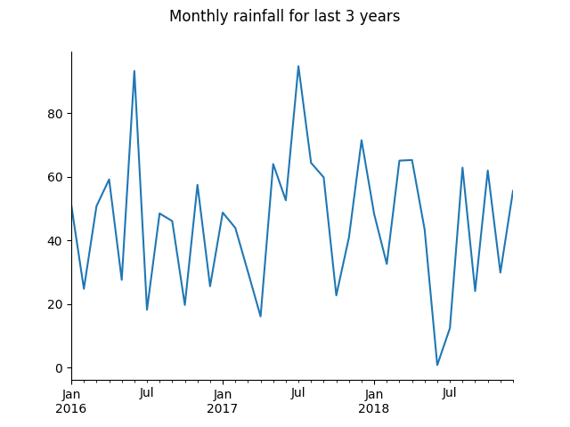

# Field Explorer API Examples

This directory contains simple examples for accessing Agrimetrics'
REST APIs. These APIs give targetted access to specific collections of
data, attributed to fields.

> For each API call made by these examples, a URL is printed which is
> suitable for pasting into another tool (e.g. a browser) to fetch the
> same results. Note that these URLs will contain your API key, and so
> should not be shared publically.

## Field Facts, Forecasts and Trends APIs Example
This example does the following:
* Calls Field Finder to return the ID for the field at a specified location
* Calls Field Facts, Field Trends and Field Forecasts to return detailed information about that field
* Parses the results and plots them on a series of graphs
* Prints selected results in tabular format

```bash
$ python field-explorer-examples/field_explorer.py
```



## Field Search API Example
This example does the following:
* Calls Field Search to:
  * search an area for fields that grew wheat in 2018
  * return the soil and historical rainfall properties for matching fields
* Parses the results and plots them on a series of graphs
* Prints selected results in tabular format

```bash
$ python field-explorer-examples/field_search.py
```

## Field Boundaries API Example
This example does the following:
* Calls Field Boundaries to obtain all the boundaries for:
  * fields in an area defined by a shape, results as JSON
  * fields in an area defined by a centre point and radius, returning the results as a [GeoJSON](https://en.wikipedia.org/wiki/GeoJSON) `FeatureCollection`
  * a field with a known Agrimetrics field ID, results as GeoJSON
* Collects all pages of results by making multiple calls to the API
* Prints selected field ids and boundaries

```bash
$ python field-explorer-examples/field_boundaries.py
```
