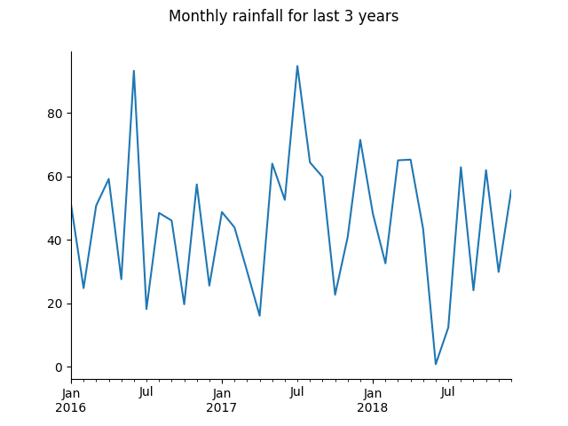

# Field Explorer Examples

This repository contains some examples of how to call Agrimetrics' Field Explorer APIs.

Pre-requisites: 
* Python 3.6+ 
* a valid Field Explorer subscription key must be obtained and set in your environment as `API_KEY`. 

To obtain your subscription key:
* Sign-up to Agrimetrics via either the [Developer Portal](https://developer.agrimetrics.co.uk) or the [Field Explorer Demo](https://app.agrimetrics.co.uk).
* Subscribe to Field Explorer by pressing 'Subscribe' in the [Field Explorer Product page](https://developer.agrimetrics.co.uk/products/field-explorer)

To setup your python environment, install the dependencies via:

```bash
> pip install -r requirements.txt
```

Alternatively, you can use `pipenv`

```bash
> pipenv install
```

## API Examples

> For each API call made by these examples, a URL is printed which is suitable for pasting into another tool (e.g. a browser) to fetch the same results. Note that these URLs will contain your API key, and so should not be shared publically.

### Field Facts, Forecasts and Trends APIs Example
This example does the following:
* Calls Field Finder to return the ID for the field at a specified location
* Calls Field Facts, Field Trends and Field Forecasts to return detailed information about that field
* Parses the results and plots them on a series of graphs
* Prints selected results in tabular format

```
python field-explorer-examples/field_explorer.py
```



### Field Search API Example
This example does the following:
* Calls Field Search to:
  * search an area for fields that grew wheat in 2018
  * return the soil and historical rainfall properties for matching fields
* Parses the results and plots them on a series of graphs
* Prints selected results in tabular format

```
python field-explorer-examples/field_search.py
```

### Field Boundaries API Example
This example does the following:
* Calls Field Boundaries to obtain all the boundaries for:
  * fields in an area defined by a shape, results as JSON
  * fields in an area defined by a centre point and radius, results as a [GeoJSON](https://en.wikipedia.org/wiki/GeoJSON) `FeatureCollection`
  * a field with a known Agrimetrics field ID, results as GeoJSON
* Collects all pages of results by making multiple calls to the API
* Prints selected field ids and boundaries

```
python field-explorer-examples/field_boundaries.py
```

### GraphQL API Example
This example does the following:
* Get the soil information for the area specified by a custom polygon.
* Get the soil information for the area within 3500m of the default point location.
* Get the area, altitude and soil information for a specific field.
* For a given field id, get all the total daily rainfall since the start of the month.
* Get the ids of all fields that lie within a 10000m radius of the default point location.

```
python graphql-examples/field_examples.py
```

# Further Reading

* [Agrimetrics Developer Portal](https://developer.agrimetrics.co.uk/docs/services/) - full API documentation
* [GeoJSON](https://geojson.org/) - GeoJSON specification
* [JSON-LD](https://json-ld.org/) - JSON-LD specification
* [Pandas](https://pandas.pydata.org/) - Python Data Analysis Library used by these examples
* [matplotlib](https://matplotlib.org/gallery/index.html) - Python 2D plotting library used by these examples
* [GraphQL](https://graphql.org/) - GraphQL is a query language for APIs and a runtime for fulfilling those queries with your existing data.
* [pipenv](https://docs.pipenv.org) - Pipenv is a dependency manager for Python projects. If you’re familiar with Node.js’ npm or Ruby’s bundler, it is similar in spirit to those tools.
